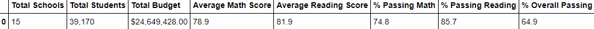
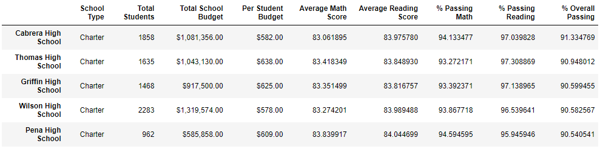
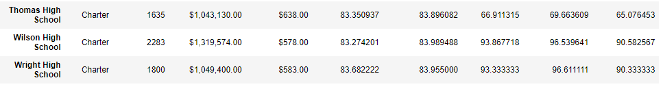
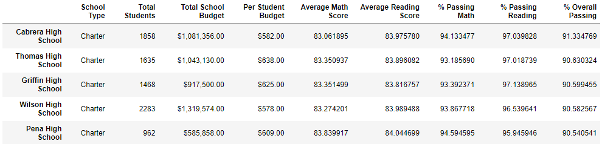
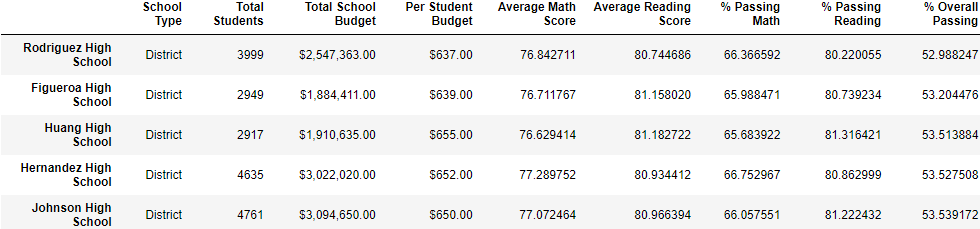
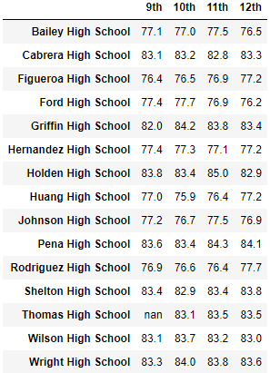
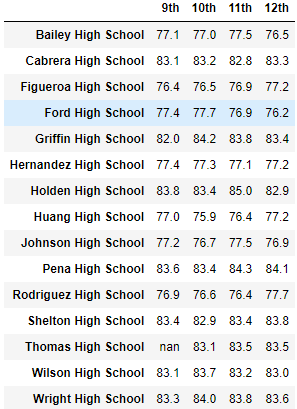
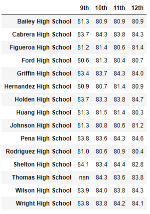
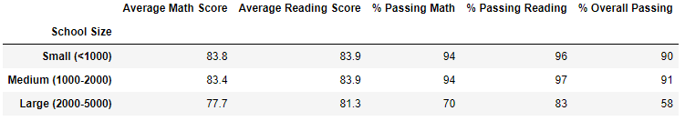
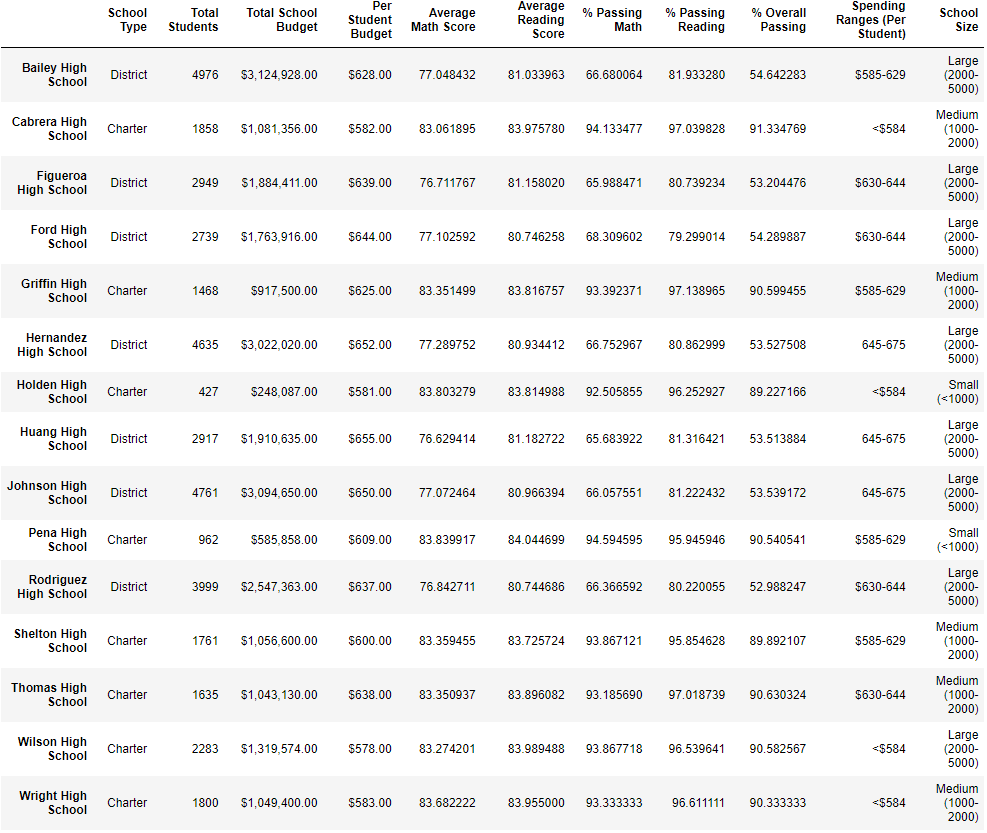

# School District Analysis

## Overview
Analysis of school district data regarding standardized test data in order to interpret overall school performance. We have been working closely with Maria to interpret the data and categorize the grades/ performance across grades 9 through 12. However, it has been brought to Maria's attention by the school board that the students_complete csv file we were working with appears to have showed tampered grades, specifically for the reading and math grades of 9th graders of Thomas High School thus implying academic dishonesty. Since we have already performed an analysis on this specific data set before, Maria has tasked us in repeating it but this time omitting the Thomas High School 9th grades reading and math scores in order to better represent the overall school district data.

## Results

*District Summary*

*District Summary without 9th grade THS scores*

*School Summary*

*School Summary without 9th grade THS*

*Top Five Schools*

*Bottom Five Schools*

*Math Grades*

*Math Grades without 9th grade THS*

*Reading scores without 9th grade THS*

*Scores by School type*

*Scores by school type without 9th grade THS*

*School Spending by Size*

*School Spending without 9th grade THS*

