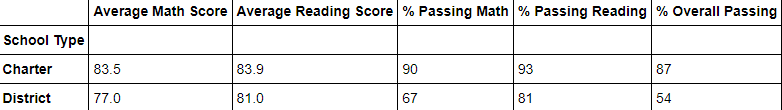

# School District Analysis

## Overview
Analysis of school district data regarding standardized test data in order to interpret overall school performance. We have been working closely with Maria to interpret the data and categorize the grades/ performance across grades 9 through 12. However, it has been brought to Maria's attention by the school board that the students_complete csv file we were working with appears to have showed tampered grades, specifically for the reading and math grades of 9th graders of Thomas High School thus implying academic dishonesty. Since we have already performed an analysis on this specific data set before, Maria has tasked us in repeating it but this time omitting the Thomas High School 9th grades reading and math scores in order to better represent the overall school district data.

## Results

# District
*District Summary*

*District Summary without 9th grade THS scores*

When comparing the disctricts before and after the omition of the Thomas High School 9th grade students, we can observe a very miniscule difference in the data. We can see a difference of .20% between the percentage of students passing math. There is a difference of .1% of the students passing readying. The percentage overall was impacted by roughly .3%. Based off this new analysis, we can observe the small changes the omittion of data presented and see that it actually did impact the overall school district data, albeit a very small but noticeable difference.

*School Summary*

*School Summary without 9th grade THS*

Upon analysis of the two tables presenting the school summary before and after the removal of the Thomas High School 9th graders, we observe that:
- There is a sharp decrease in overall passing percentage, observing the drop from **90.9%** to roughly **65%**
- There is a sharp decrease in the passing math percentage category, observing the drop from **93.2** to roughly **66.9%**
- There is a sharp decrease in the passing reading percentage category, observing the drop from **97.3%** to roughly **69.6%**

*Top Five Schools*

Before omitting the scores of the Thomas High School 9th graders, the analysis reveals that Thomas High School was ranked second best performing school. After the new analysis with the modified data, we can see that Thomas High School dropped from second place to eight place overall. It is extremely important to note that just by removing one grade of scores, it impacted the school in the district in such a drastic way.

*Bottom Five Schools*

Comparing the before and after list of the bottom five lowest performing schools in the district, we can see it stayed the same, with Thomas High School not entering the bottom five after losing its place in the top five.

*Math Grades*

*Math Grades without 9th grade THS*

As per instruction, the math scores shows the Thomas High School students being omitted with a NaN, signifying the analysis is not account for it.

*Reading scores without 9th grade THS*

Similar to the math grades analysis as per instruction, the math scores shows the Thomas High School students being omitted with a NaN, signifying the analysis is not account for it as well.

*Scores by School type*

*Scores by school type without 9th grade THS*

When analyzing the total spending between schools, school type and per student, we can see there was no significant impact in the overall spending since the analysis is only accounting for the change in math and reading scores. Furthermore, when analyzing the new math, reading and overall percentage scores in the two tables referenced above, we do see a siginificant change in the aforementioned scores:
- The overall passing percentage changed from **73%** to *67%**
- The math passing percentage saw a decrease from **73%** to **67%**
- the reading passing percentage saw a decrease from **84%** to **77%**

*Scores by school spending size*

*Scores by school spending size without 9th grade THS*

When comparing the before/ after of analysis of the school size, we do see that in the medium school range (where Thomas High School falls under), we see the percentages of:
- students who passed reading decrease from **97%** to **91%**
- students who passed math decrease from **94%** to **88%**
- students who passed overall decrease from **91%** to **85**

*Scores by school type*

*Scores by school type without 9th grade THS*

We also observe the changes in grades impacting overall scores for the charter schools with scores dropping around by 4% between all percentage categories.

## Summary

All in all, the omitted school data for one grade level did impact the overall school district analysis data. Even though it appeared miniscule, the changes did have an impact with scores from reading, math and overall dropping in all categories listed in the csv spreadsheet. The altered grades boosted the performance of Thomas High School as a whole to the point at first analysis, it appeared they were performing tremondously well. But after changes were made to the spreadsheet, we observed how small differences in less than 5% significantly impacted the performance of Thomas High School
